# 从零打造你的前端开发脚手架

​		在实际开发过程中，我们经常都会用到脚手架来构建前端工程项目，常见的主流框架都有自己的脚手架，`vue-cli`、`create-react-app`、`angular-cli`。在大型公司都会有内部定制化的脚手架开发工具，使用脚手架可以大幅提升项目的构建速度，通过命令行的交互，选择你所需要的配置与集成，可快速完成初始项目的创建。

### **什么是脚手架**

​		脚手架是一类快速形成工程化目录的工具(command-line-interface, 缩写：`CLI`)，简单来说，脚手架就是帮我们减少「为重复性工作而做的重复性工作」的工具。

### 脚手架的初始化

​		新建一个文件夹(文件夹名字不能为中文)打开命令行，输入`npm init -y`，会出现以下情况。

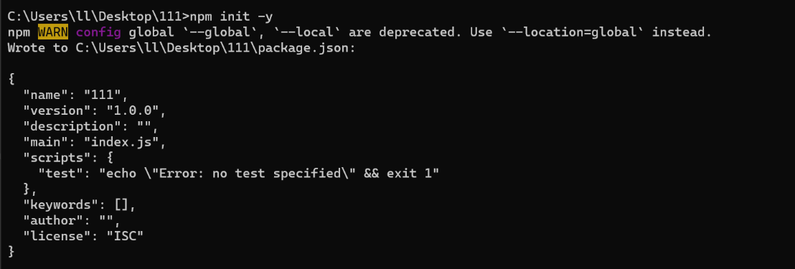

|      名称      |                         意思                          |       默认值       |
| :------------: | :---------------------------------------------------: | :----------------: |
|  package name  |                       包的名称                        | 创建文件夹时的名称 |
|    version     |                        版本号                         |       1.0.0        |
|  description   |                       包的描述                        |  创建文件时的名称  |
|  entry point   |                       入口文件                        |     `index.js`     |
|  test command  |                       测试命令                        |         —          |
| git repository |                      git仓库地址                      |                    |
|    keywords    |     关键词，上传到`npm`官网时在页面中展示的关键词     |         —          |
|     author     | 作者信息，对象的形式，里面存储一些邮箱、作者名、`url` |         —          |
|    license     |                         执照                          |        MIT         |

这就是输入初始化命令时会询问的东西，回答完这些后就会生成一个 `package.json` 的文件，这个文件就是记录包的信息。

如果想要了解更多，可查看如下地址：

[package.json详解](https://www.npmjs.cn/files/package.json/)

### 脚手架依赖安装

用到如下依赖请安装。

```text
npm i path
npm i chalk@4.1.0
npm i fs-extra
npm i inquirer@8.2.4
npm i commander
npm i axios
npm i download-git-repo
```

### 目录结构如下

```text
my-cli
├─ bin
│  ├─ index.js   
├─ package.json 
└─ package-lock.json
```


### 创建入口文件

在询问问题前我们需要先创建一个入口文件，创建完成后在`package.json`中添加bin项，并且将入口文件路径写进去,bin下面的`my-cli`为启动命令

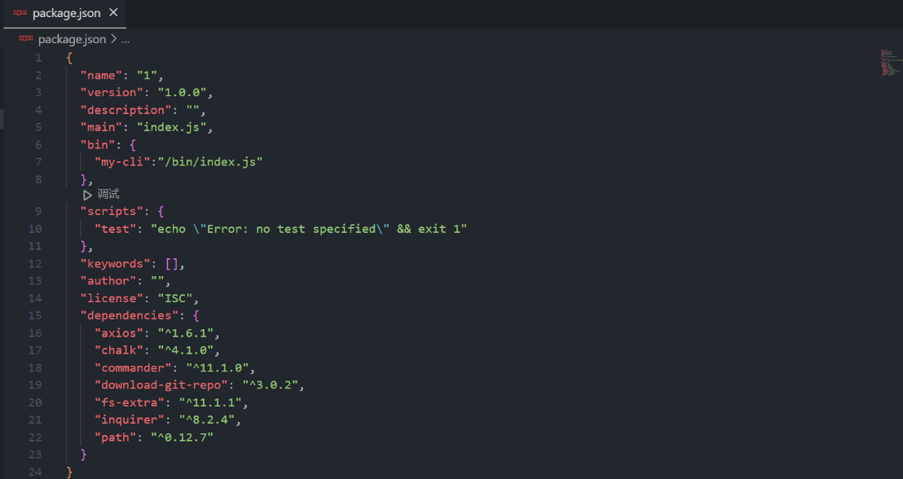

填写完入口文件路径后在入口文件`index.js`文件中最顶层声明文件执行方式为node。

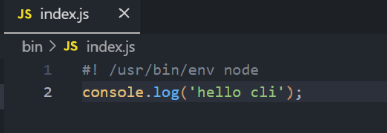

```text
#! /usr/bin/env node
```

写完后我们需要测试一下我们是否可以正常的访问的我们的脚手架，在`bin`文件夹打开命令行，输入 `npm link` ，该命令会创建一个全局访问的包的快捷方式，这个是临时的就是本地测试的时候用的，这个在命令行输入你的脚手架的名称可以看到入口文件输出的内容。

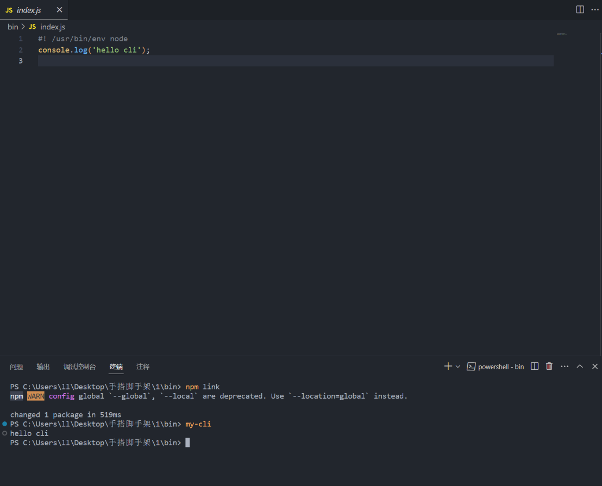

### 最基本的交互命令

在完成上一步后我们就要开始与用户进行交互了，这个时候我们就需要用到一个用于自定义命令行指令的依赖 [commander](https://github.com/tj/commander.js/blob/master/Readme_zh-CN.md)。

引入依赖: `const program = require('commander')`

### 简单介绍一下commander依赖常用的方法

#### command

命令。`.command()`的第一个参数为命令名称。命令参数可以跟在名称后面，也可以用`.argument()`单独指定。

*参数可为必选的（尖括号表示）、可选的（方括号表示）或变长参数（点号表示，如果使用，只能是最后一个参数）*

#### option

选项。`option()`可以附加选项的简介。第一个参数可以定义一个短选项名称（-后面接单个字符）和一个长选项名称（–后面接一个或多个单词），使用逗号、空格或`|`分隔。第二个参数为该选项的简介。

#### action

处理函数。用`command创建的自定义命令`的处理函数,action携带的实参顺序就是命令上的参数的顺序。

详情代码如下：

```javascript
#! /usr/bin/env node
const { Command } = require('commander')
const program = new Command()

program
    .name('my cli')
    .description('这里是描述文案')
    .version('1.0.0')
// !注意create后面必须有空格
program.command('create <app-name>')
    .description('创建一个新工程')
	// -f or --force 为强制创建，如果创建的目录存在则直接覆盖
	.option('-f, --force', '如果项目存在则强行覆盖')
    // 这个name 就代表第一个必填参数 options就代表其余， 如果有第二个就在写一个，最后一个永远是剩余参数
    .action((name,option) => {
        console.log('[ 工程名称 ]', name);
    })

// 解析用户执行命令传入参数
program.parse(process.argv);
```

执行效果如下：

`my-cli create my-first-cli`

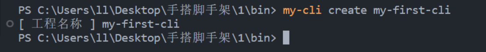

这里我们创建了一个叫 `create` 的自定义指令，这个命令有着必填的项目名、可以选择的强制覆盖的选项 `-f`，有着处理函数`action`。

这里请注意 解析用户命令参数的操作一定要在最后一行否则什么都不会出现。

`program.parse(process.argv)`

### 创建第一个模板项目

在创建了一个基本命令 `create` 后我们就要开始创建一个模板并在用户使用该命令时复制并修改我们所创建的模板。

### 创建一个模板

我们在复制模板前需要一个模板，现在的我们随便创建一个文件夹并取名为template里面创建一个html。

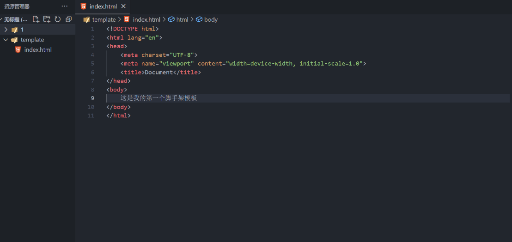

像这样创建好后，我们就有了一个模板，但我们依然需要让模板有一个可被下载、查询的地方，这里我选择的是使用 `git` 组织仓库，因为这样可以直接通过`git`提供的接口进行文件下载，包括选择不同的模板等。

### 上传模板

我们先去 `git` 的官网中新建一个存放模板的组织仓库。

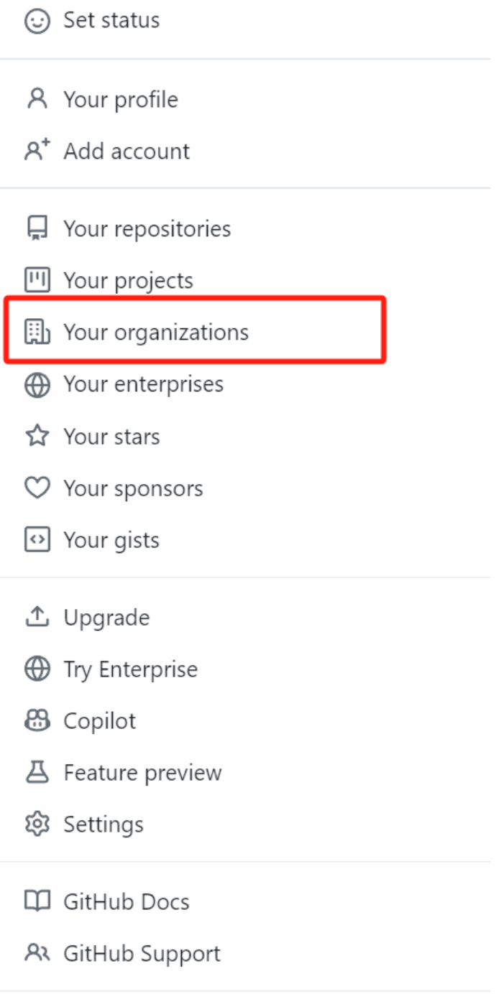

点击图中的位置进入组织，并点击下图的创建

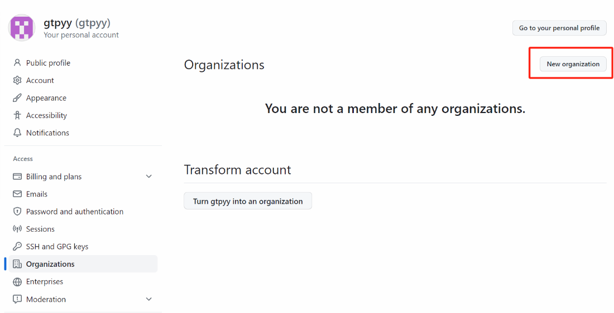

会进入到付费的位置，没有大需求就选免费

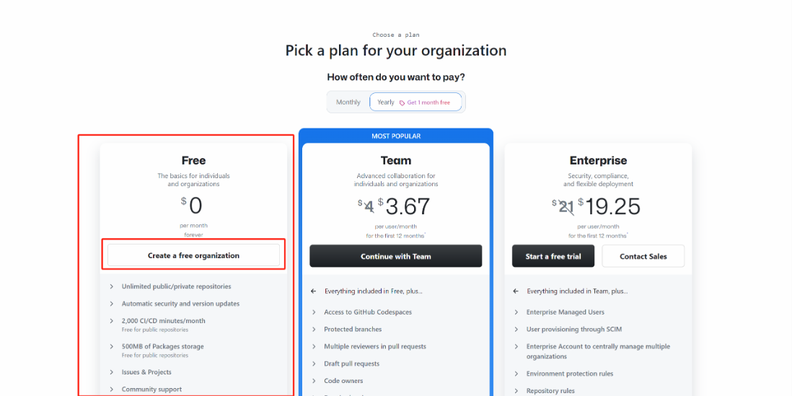

填写信息完基本就算创建成功了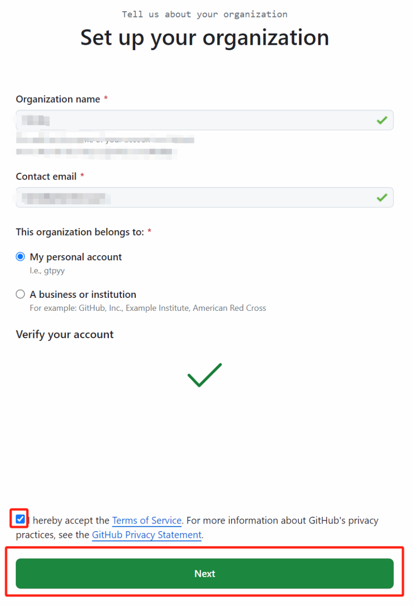

接下来在组织中创建一个储存库

这里我们暂且选择可见的仓库，千万不要选择私人仓库，否则`git`接口会找不该仓库

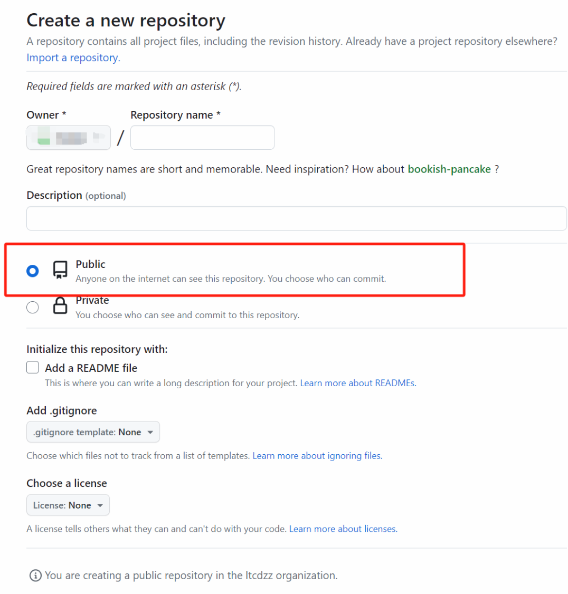

创建好后的仓库，就直接将模板代码提交至本次创建的仓库中就可以了。

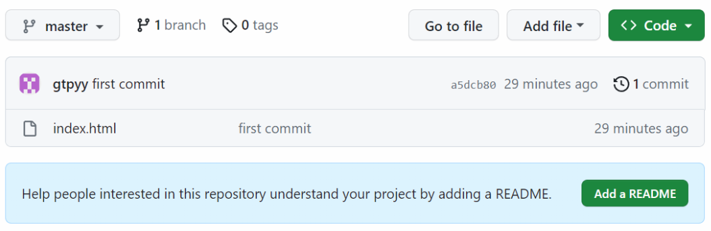

#### 增加一个新的版本标签

跟着下列图操作

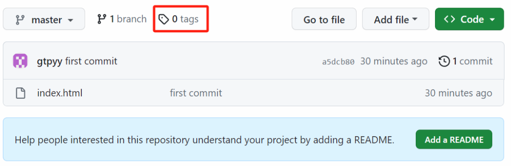

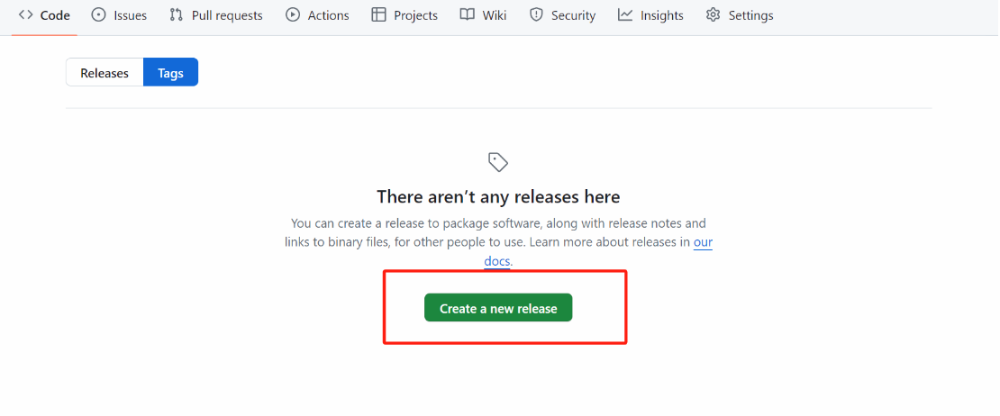

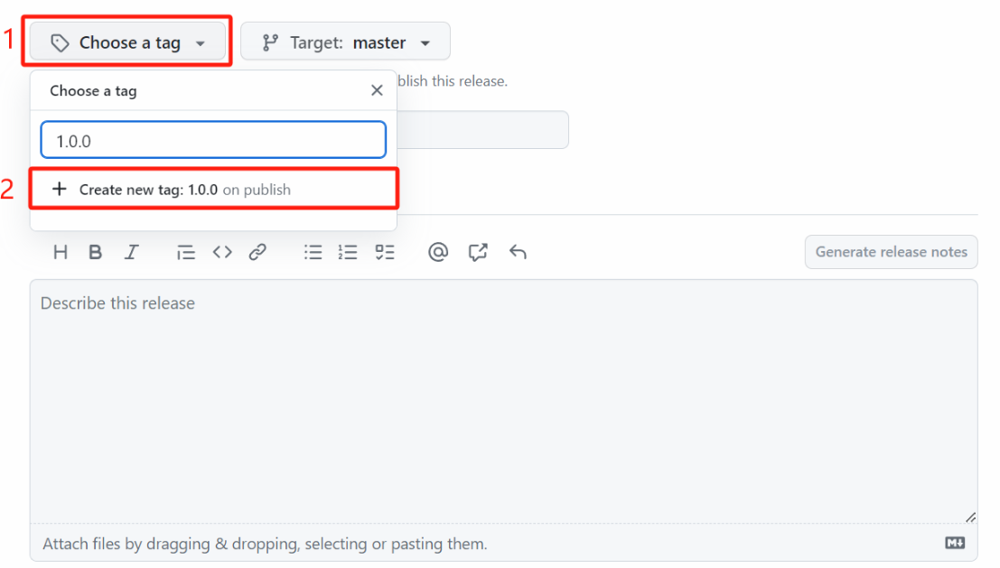

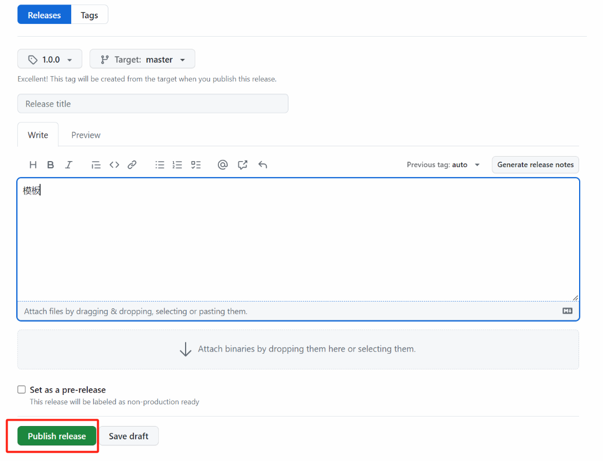

点击发布发行版后就可以了。

### 下载模板

我们上传模板后可以通过 `git` 提供的接口来完成下载模板的功能，首先我们先去询问用户要下载的模板名称然后在用依赖包来进行下载：


### create命令后续操作

上传模板后，我们就可以继续完成`create`命令的后续操作了。

### create命令下使用创建函数

```javascript
program
.command('create <app-name>')
.description(chalk.cyan('创建一个新工程'))
// -f or --force 为强制创建，如果创建的目录存在则直接覆盖
.option('-f, --force', 'overwrite target directory if it exist')
.action((name, options) => {
    // 打印执行结果
    require("../lib/create")(name, options)
})
```

### 创建create文件

创建 create 文件用来回应用户的 create 命令。

` lib/create.js`

```javascript
const path = require('path')
// fs-extra 对fs模块的扩展，支持promise语法
const fs = require('fs')
// 用于交互式询问用户问题
const inquirer = require('inquirer')
// 导出Generator类
const Generator = require('./Generator')

// 抛出一个方法用来接收用户要创建的文件夹（项目名）和 其他参数
module.exports = async function (name, options) {
    // 当前命令行选择的目录
    const cwd = process.cwd()
    // 需要创建的目录地址
    const targetAir = path.join(cwd, name)

    // 判断是否存在相同文件夹
    // 目录是否已经存在
    if (options.force) {
        await fs.remove(targetAir)
    } else {
        // 询问用户是否确定要覆盖
        let { action } = inquirer.createPromptModule([
            {
                name: 'action',
                type: 'list',
                message: '目录已存在，请选择',
                choices: [
                    {
                        name: '覆盖',
                        value: 'overwrite'
                    }, {
                        name: '取消',
                        value: false
                    }
                ]
            }
        ])
        // 如果用户拒绝覆盖停止剩余操作
        if (!action) {
            // return
        } else if (action === 'overwrite') {
            // 移除已存在的目录
            console.log(`\r\nRemoving...`);
            await fs.remove(targetAir)
        }
    }
    // 新建generator类
    const generator = new Generator(name, targetAir);
    generator.create();
}
```

### 创建generator类

`lib/Generator.js`

```javascript
const { getRepoList, getTagList } = require('./http')
const ora = require('ora')
const inquirer = require('inquirer')
const util = require('util')
const downloadGitRepo = require('download-git-repo') // 不支持promise
const path = require('path')
const fs = require('fs')

// 添加加载动画
// 添加加载动画
async function wrapLoading(fn, message, ...args) {
    // 使用 ora 初始化，传入提示信息 message
    const spinner = ora(message)
    // 开始加载动画
    spinner.start();

    try {
        // 执行传入方法 fn
        const result = await fn(...args);
        // 状态为修改为成功
        spinner.succeed();
        return result;
    } catch (error) {
        // 状态为修改为失败
        spinner.fail('请求失败重新获取 ...',error);
    }
}

class Generator {
    constructor(name, targetDir) {
        // 目录名称
        this.name = name;
        // 创建位置
        this.targetDir = targetDir;
        // 对 download-git-repo 进行 promise 化改造
        this.downloadGitRepo = util.promisify(downloadGitRepo)
    }

    // 获取用户选择的模板
    // 1、从远程拉取模板数据
    // 2、用户选择自己新下载的模板名称
    // 3、return 用户选择的名称
    async getRepo() {
        // 1、从远程拉取模板数据
        const repoList = await wrapLoading(getRepoList, '等待提取模板');
        if (!repoList) return;
        // 过滤我们需要的模板名称
        const repos = repoList.map(item => item.name);

        // 2、用户选择自己新下载的模板名称
        const { repo } = await inquirer.prompt({
            name: 'repo',
            type: 'list',
            choices: repos,
            message: '请选择一个模板来创建项目'
        })

        // 3、return 用户选择的名称
        return repo;
    }

    // 获取用户选择的版本
    // 1、基于 repo 结果，远程拉取对应的 tag 列表
    // 2、自动选择最新版的 tag
    async getTag(repo) {
        // 1、基于 repo 结果，远程拉取对应的 tag 列表
        const tags = await wrapLoading(getTagList, '等待提取标签', repo);
        if (!tags) return;

        // 过滤我们需要的tag名称
        const tagsList = tags.map(item => item.name);

        // 2、return 用户选择的tag
        return tagsList[0]
    }

    // 下载远程模板
    // 1、拼接下载地址
    // 2、调用下载方法
    async downloadGitRepo(repo, tag) {
        // 1、拼接下载地址
        const requestUrl = `github组织名/${repo}${tag ? '#' + tag : ''}`;

        // 2、调用下载方法
        await wrapLoading(
            this.downloadGitRepo,//远程下载方法
            '等待下载模板', //加载提示信息
            requestUrl, // 参数1：下载地址
            path.resolve(process.cwd(), this.targetDir) // 参数2：创建位置
        )
    }

    // 核心创建逻辑
    // 1、获取模板名称
    // 2、获取 tag 名称
    // 3、下载模板到模板目录
    // 4、对uniapp模板中部分文件进行读写
    // 5、模板使用提示
    async create() {
        // 1、获取模板名称
        const repo = await this.getRepo()

        // 2、获取 tag 名称
        const tag = await this.getTag(repo)

        // 3、下载模板到模板目录
        await this.download(repo, tag)

        // 5、模板使用提示
        console.log(`\r\nSuccessfully created project ${chalk.cyan(this.name)}`)
        console.log(`\r\n  cd ${chalk.cyan(this.name)}`)
        console.log(`\r\n  启动前请务必阅读 ${chalk.cyan("README.md")} 文件`)
    }
}

module.exports = Generator;
```

### 创建http文件

新建一个`http.js`的文件用来存放要请求的接口，我们用`axios`去请求.

```javascript
// 通过 axios 处理请求
const axios = require('axios')

axios.interceptors.response.use(res => {
  return res.data;
})

/**
 * 获取模板列表
 * @returns Promise
 */
async function getRepoList() {
  return axios.get('https://api.github.com/orgs/github组织名/repos')
}

/**
 * 获取版本信息
 * @param {string} repo 模板名称
 * @returns Promise
 */
async function  getTagList(repo) {
  return axios.get(`https://api.github.com/repos/github组织名/${repo}/tags`)
}

module.exports = {
  getRepoList,
  getTagList
}

```

### 搭建完成

完成这一步后我们再去进行`mycli create my-first-cli`命令，会看到下图。

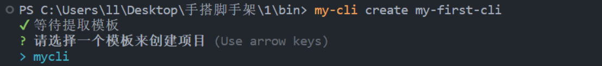

会询问要创建的模板项目，我这里的远程组织模板叫做`mycli`，大家选择自己的模板回车，稍等一下就会创建成功，并看到在你使用命令的路径上多出一个项目名的文件夹，就成功了

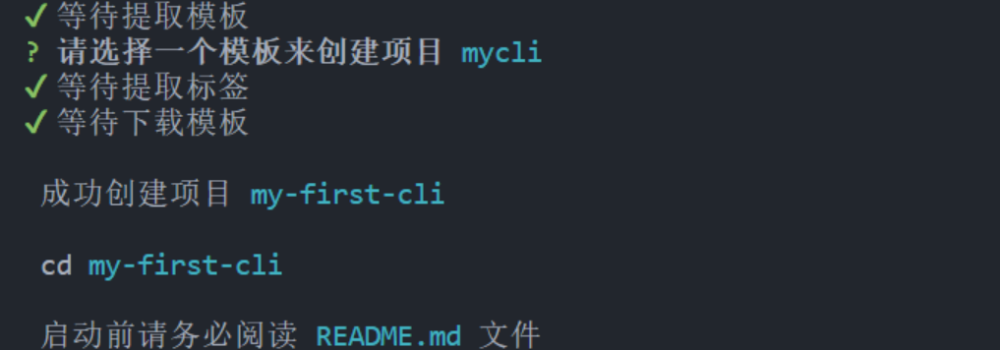

如果有对模板在下载后进行操作的需求可以使用`fs`依赖进行操作，到这里为止我们已经完成了一个简易的脚手架搭建，感谢大家耐心观看。

